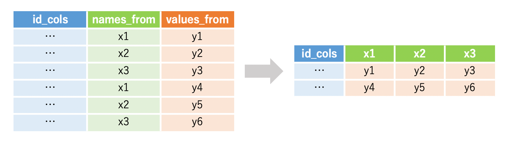
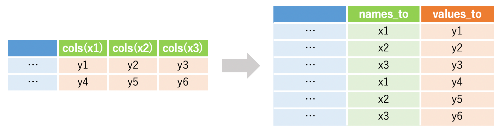

<br>

<h2 align = "center">**【KAKEN】データの要約（３）**</h2>

<h2 align = "center">**ー配分額を年度別に集計ー**</h2>

___
<p align = "right">*Takuya Kubo, `r format(Sys.time(), '%Y/%m/%d')`*</p>

<br>

### **０. はじめに**
このページでは、主にdplyrパッケージを用いて研究機関ごとの配分額を年度別に集計する方法を紹介いたします。具体的には以下のような集計・操作を行なっていきます。

<div style="padding-top: 10px; border: 1px dotted #333333;">
- 研究機関ごとの科研費の配分額を年度別に集計する  
- 集計したデータの形式を横持ち・縦持ち変換する
</div>

<br>

### **１. 下準備**
必要となるパッケージは以下の通りです。今回は2017年度から2019年度の採択課題データを用いますが、データ量が多くて大変なので、あらかじめ必要な列のみを選択してデータを読み込んでいます。
```{r message = F, warning = F}
# インストールされていない場合は、以下のコマンドの「#」を外して実行
# install.packages("data.table")
# install.packages("dplyr")
# install.packages("tidyr")
# install.packages("DT")
# install.packages("ggplot2")

# パッケージの読み込み
library(data.table)   # 高速なデータインポートのため
library(dplyr)        # データの整理のため
library(tidyr)        # 
library(DT)           # 集計表の出力のため
library(ggplot2)      # グラフ化のため

# 使用するデータのインポート（研究機関、研究種目、総配分額のみ）
d2017 <- fread("kaken_2017.csv", select = c("研究機関", "研究種目", "総配分額"))
d2018 <- fread("kaken_2018.csv", select = c("研究機関", "研究種目", "総配分額"))
d2019 <- fread("kaken_2019.csv", select = c("研究機関", "研究種目", "総配分額"))
```

<br>

### **２. 下準備**
３年度分のデータを別々に集計するのは手間なので、dplyrパッケージのbind_rows関数を用いてデータを統合しておきます。なお、結合する前に総配分額をnumeric型に変換し、年度情報も加えています。また、データの量が多いので、研究機関は旧帝大に限定しておきます。
```{r}
# データフレームの縦結合
D1 <- bind_rows(        
  
  # 総配分額をnumeric型に変換し、年度情報の列を作成
  d2017 %>% mutate(総配分額 = as.numeric(総配分額), 年度 = 2017),  
  d2018 %>% mutate(総配分額 = as.numeric(総配分額), 年度 = 2018),
  d2019 %>% mutate(総配分額 = as.numeric(総配分額), 年度 = 2019) 
  
  ) %>%
  
  # 研究機関の絞り込み
  filter(研究機関 %in% c("北海道大学", "東北大学", "東京大学", "名古屋大学", "京都大学", "大阪大学", "九州大学"))
  
D1 %>% 
  sample_n(500) %>%  # 500行をランダムに選択
  datatable()        # 可視化
```

<br>

### **３. 機関ごとに配分額を年度別集計する**
集計のための基本的な考え方は前回までと同様です。group_by関数により研究機関と年度でグループ化を行い、各グループ内で総配分額の合計を計算します。

```{r}
D2 <- D1 %>% group_by(研究機関, 年度) %>%
  summarize(配分額 = sum(総配分額))

datatable(D2)
```

<br>

研究種目の情報も加味したければgroup_by関数により研究機関と年度と研究種目でグループ化を行えば良いです。

```{r}
D3 <- D1 %>% group_by(研究機関, 年度, 研究種目) %>%
  summarize(配分額 = sum(総配分額))

datatable(D3)
```

<br>

### **４. データフレームを横持ちに変換する**
これまで見てきた集計表は、更に踏み込んだ分析を行ったりグラフ化する場合を想定したものであり、他の人に見せる形式としては適切ではありません。こういった縦に長いデータの形式を「縦持ち」と言いますが、横に長い「横持ち」のデータの方が表としては見やすくなるかと思います。そこで、以下ではtidyrパッケージのpivot_wider関数を用いて、縦持ちデータを横持ちデータに変換する方法を紹介いたします。<br>

<div align = "center">

</div>

pivot_wider関数は上記のような変換を行ってくれる関数です。引数として、id_colsは変換後も列として残す列名、names_fromは新たに列として展開する列名、values_fromは展開した列の値として用いる列名を指定します。今回は各年度の配分額をそれぞれ独立した列として展開したいので、names_fromには年度列を、values_fromには配分額列を指定します。研究機関列はそのまま残しておきたいので、id_colsに指定すればOKです。


```{r}
D2_wide <- D2 %>% 
  
  pivot_wider(id_cols = 研究機関,     # 変換後も列として残す列 
              names_from = 年度,      # 変換後に列として展開される列名
              values_from = 配分額)   # 横持ちに変換した際の値

datatable(D2_wide)
```

<br>

研究種目を加えて集計したデータを横ち変換する場合は研究種目もid_colsに指定しておきます。注意点としては、もともと該当する年度の配分額の情報がない場合にはデフォルトでNAが格納されます。NA以外で例えば「0」にしたい場合には、「values_fill = list(配分額 = 0)」と指定すれば良いです。

```{r}
D3_wide <- D3 %>% 
  
  # 横持ちに変換
  pivot_wider(id_cols = c(研究機関, 研究種目),   
              names_from = 年度,                
              values_from = 配分額)             

datatable(D3_wide)
```

<br>

### **５. 縦持ちのデータに変換する**
次に、横持ちのデータを縦持ちのデータに変換する方法を紹介していきます。今度はtidyパッケージのpivot_longer関数を使います。pivot_longer関数は引数としてcols、names_to、values_toを指定すれば縦持ちのデータに変換することができます。colsは縦持ちに変換したい複数の列名を指定します。今回の例では2017、2018、2019の列です。names_toはこれら3つの列名をまとめてできる新しい列の名前を指定します。values_toは3つの列の値をまとめてできる新しい列の名前を指定します。具体的なイメージとしては以下の図をご覧ください。

<div align = "center">

</div>


```{r}
D2_wide %>% 
  
  pivot_longer(cols = c(`2017`, `2018`, `2019`),     # 縦持ちに変換する列名
               names_to = "年度",                    # 上記の列名を格納する列名
               values_to = "配分額"                  # 縦持ち変換後に値を格納する列名
               ) %>%
  
  datatable()
```

<br>

研究種目を加えて集計したデータも縦持ちに戻します。注意点としましては、横持ちに変換した際に生じたNAが縦持ちに戻した時にも維持されているため、元々のデータフレームよりも行数が多くなります。このNAを取り除くこともできますので、その際には「values_drop_na = TRUE」と指定してみください。
```{r}
D3_wide %>% 
  
  pivot_longer(cols = c(`2017`, `2018`, `2019`), 
               names_to = "年度", 
               values_to = "配分額",
               values_drop_na = FALSE) %>%
  
  datatable()
```

<br>

### **６. 終わりに**
今回は科研費の配分額を年度別に集計する方法を紹介いたしました。今回は年度別の集計結果を表形式でまとめましたが、最終的にはグラフ化まで行うことが多いように思います。年度推移をグラフ化するための方法についても別のページで紹介していますので、詳しくは[こちら](kaken_plot_02.html)をご参照ください。また、今回は縦持ち変換/横持ち変換も合わせて紹介しましたが、これらは公的な統計データを扱う時に特に便利なスキルかと思います。公的統計データは横持ちのデータが多く、そのままの形式では集計やグラフ化が困難です。また、横持ちから縦持ちに変換して集計やグラフ化を行ったり、横持ちに戻して表形式で表現したりと行ったり来たりします。縦持ち変換/横持ち変換をマスターすると扱えるデータの幅が広がりますので、皆さんもこれを機会に練習してみてください。